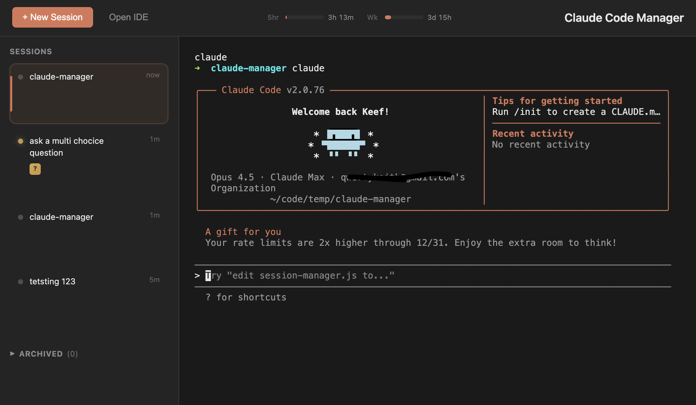

# Claude Manager

Manage many sessions of Claude Code simply and more easily



"Better than the one we use at Atlassian" - friend who works at Atlassian, Jan 2026

## Features

- Manage multiple Claude Code sessions in one UI with the fully featured CLI
- Real-time status indicators to quickly see which session needs attention
- Track your usage against plan limits
- Prompt summarization

## Use

To run directly from npm using your Claude CLI

```bash
npx @qwertykeith/claude-code-manager
```

## Requirements

- Node.js 18+
- Claude Code CLI installed (`claude` command available)
- Python 3 (optional) - enables accurate usage %

## Development

```bash
npm install
npm run dev
```
